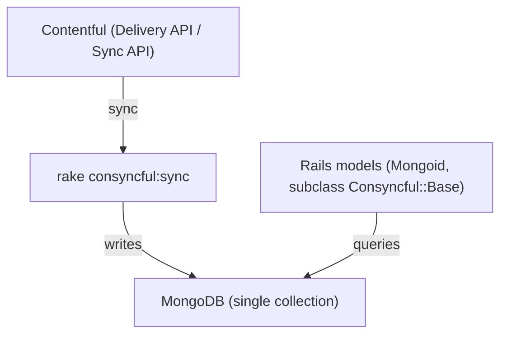

# Consyncful

[Contentful](https://www.contentful.com/) -> MongoDB synchronisation for Rails.

## Why Consyncful?

Requesting complicated models from the Contentful Delivery API in Rails applications is often too slow, and makes testing applications painful. Consyncful uses Contentful's synchronisation API to keep a local, up-to-date copy of the entire content in a Mongo database.

Once the content is available locally, finding and interact with contentful data is as easy as using [Mongoid](https://docs.mongodb.com/mongoid/current/tutorials/mongoid-documents/) ODM.

This gem doesn't provide any integration with the management API, or any way to update Contentful models from the local store. It is strictly read only.



## Contents
- [Setup](#setup)
  - [Installation](#installation)
  - [Configuration](#configuration)
- [Usage](#usage)
  - [Creating contentful models in your Rails app](#creating-contentful-models-in-your-rails-app)
  - [Synchronizing contentful data](#synchronizing-contentful-data)
  - [Finding and interacting with models](#finding-and-interacting-with-models)
    - [Querying](#querying)
    - [References](#references)
    - [Finding entries from different content types](#finding-entries-from-different-content-types)
  - [Sync callbacks](#sync-callbacks)
  - [Using Locales for specific fields](#using-locales-for-specific-fields)
  - [Configuring what Mongo database Consyncful uses](#configuring-what-mongo-database-consyncful-uses)
  - [Why do I have to use MongoDB?](#why-do-i-have-to-use-mongodb)
- [Development](#development)
- [Contributing](#contributing)
- [License](#license)

## Setup

### Installation

Add this line to your application's Gemfile:

```ruby
gem 'consyncful'
```

And then execute:

    $ bundle

If you don't already use Mongoid, generate a mongoid.yml by running:

    $ rake g mongoid:config


### Configuration

Create `config/initializers/consyncful.rb`. An example with common configuration is:

```rb
Consyncful.configure do |config|
  config.locale = 'en-NZ'
  config.contentful_client_options = {
    api_url: 'cdn.contentful.com',
    space: 'space_id',
    access_token: 'ACCESS_TOKEN',
    environment: 'master',        # optional
    logger: Logger.new(STDOUT)    # optional for debugging
  }

  # optional to override the Sync API defaults
  config.contentful_sync_options = { 
    limit: 50
  }
end
```

> [!IMPORTANT]
> Consyncful uses the official [contentful.rb](https://github.com/contentful/contentful.rb) client. Any `contentful_client_options` you set are passed through to that library unchanged. Sync settings in `contentful_sync_options` map to the parameters in Contentful’s [Content Delivery Sync API](https://www.contentful.com/developers/docs/references/content-delivery-api/#/reference/synchronization).


#### Configuration options

| Option | Description | Default |
| --- | --- | --- |
| `sync_mode` | How syncing is triggered: `:poll` (periodic polling used by default) or `:webhook` (sync runs when a webhook is received from contentful). | `:poll` |
| `contentful_client_options` | Options passed through to the `contentful.rb` client. Defaults include `reuse_entries: true`, `api_url: 'cdn.contentful.com'`. | `{}` (merged with defaults) |
| `contentful_sync_options` | Contentful Sync API parameters (e.g., `limit`, `type`). Defaults include `limit: 100`, `type: 'all'`. | `{}` (merged with defaults) |
| `locale` | Default locale when mapping fields. | `'en-NZ'` |
| `content_tags` | Only store entries that have **any** of these tags. | `[]` |
| `ignore_content_tags` | Ignore entries with **any** of these tags. | `[]` |
| `preserve_contentful_timestamps` | Adds `contentful_created_at` and `contentful_updated_at` to models. | `false` |
| `mongo_client` | Mongoid client to use (from `mongoid.yml`). | `:default` |
| `mongo_collection` | MongoDB collection name for all entries. | `'contentful_models'` |
| `webhook_authentication_enabled` | Require Basic Auth for the webhook endpoint (only relevant when `sync_mode: :webhook`, enabled by default). | `true` |
| `webhook_user` | Username for webhook Basic Auth (when enabled). | `nil` |
| `webhook_password` | Password for webhook Basic Auth (when enabled). | `nil` |

## Creating contentful models in your Rails application

Create models by inheriting from `Consyncful::Base`

```ruby
class ModelName < Consyncful::Base
  contentful_model_name 'contentfulTypeName'
end
```

Model fields will be dynamically assigned, but Mongoid dynamic fields are not accessible if the entry has an empty field. If you want the accessor methods to be reliably available for fields it is recommended to define the fields in the model:

```ruby
class ModelName < Consyncful::Base
  contentful_model_name 'contentfulTypeName'

  field :title
  field :is_awesome, type: Boolean
end
```

Contentful reference fields are a bit special compared with standard Mongoid associations. Consyncful provides the following helpers to set up the correct relationships:

```ruby
class ModelWithReferences < Consyncful::Base
  contentful_model_name 'contentfulTypeName'

  references_one :thing
  references_many :other_things
end
```

## Synchronizing contentful data

`Consyncful` supports **two sync modes**:
- **Polling (default)** — checks Contentful on an interval and syncs changes.
- **Webhook** — Contentful calls your app; the worker syncs when a webhook arrives.

### Continuous sync (either mode)
Run the same task in both modes — the behaviour depends on your configuration:

    $ rake consyncful:sync

- **Polling mode**: after the initial full sync, the worker polls every **15s** (configurable) and applies changes it finds.
- **Webhook mode**: after the initial full sync, the worker **does not poll**. It waits for a webhook signal and then runs a sync.


> [!NOTE]
> The first time you run this it will download all the Contentful content.

### Refresh from scratch

If you want to resynchronize everything (e.g., after model/content type renames), run:

    $ rake consyncful:refresh

This performs a full rebuild of data from contentful.

It is recommended to refresh your data if you change model names.

Now you've synced your data, it is all available via your Rails models.

### Enabling webhook mode

#### 1. Set the sync mode to webhook

```
# e.g. config/initializers/consyncful.rb
Consyncful.configure do |c|
  c.sync_mode = :webhook
end
```

#### 2. Mount the webhooks controller:
Expose the engine so Contentful can POST to it
```
# config/routes.rb
mount Consyncful::Engine, at: "/consyncful"
```
The webhook endpoint lives under this mount (e.g. `/consyncful/trigger_sync`).

#### 3. Authentication (recommended)
Webhook authentication is **on by default**:
```
Consyncful.configure do |c|
  c.webhook_authentication_required = true   # default
  c.webhook_user     = ENV["CONSYNCFUL_WEBHOOK_USER"]
  c.webhook_password = ENV["CONSYNCFUL_WEBHOOK_PASSWORD"]
end
```
To accept webhooks **without** auth (not recommended), explicitly disable it:
```
c.webhook_authentication_required = false
```

#### 4. Create the webhook in Contentful
In your Contentful space/environment, add a webhook that points to your mounted route (e.g. `https://your-app.example.com/consyncful/trigger_sync`) and select which events should trigger a sync (publish/unpublish, entries, assets, etc.). See Contentful documents here for information on setting up a webhook: [Configuring a webhook](https://www.contentful.com/developers/docs/webhooks/configure-webhook/)

> [!IMPORTANT]
> If your application is behind global authentication, VPN, or an allowlist, Contentful won’t be able to reach the webhook endpoint. Ensure that `POST` requests from Contentful can reach your mounted path (e.g. `/consyncful/...`). In many setups this means adding an ingress rule or route exemption for the webhook path. Keeping webhook authentication **enabled** (default) is recommended; configure matching credentials in the Contentful webhook.

## Finding and interacting with models

### Querying
Models are available using standard Mongoid [queries](https://docs.mongodb.com/mongoid/current/tutorials/mongoid-queries/).

```ruby
instance = ModelName.find_by(instance: 'foo')

instance.is_awesome # true
```

### References
References work like you would expect:

```ruby

instance = ModelWithReferences.find('contentfulID')

instance.thing # returns the referenced thing
instance.other_things # all the referenced things, polymorphic, so might be different types
```

**Except**:
`references_many` associations return objects in a different order from how they are ordered in Contentful. If you want them in the order they appear in Contentful, use the `.in_order` helper:

```ruby
instance.other_things.in_order # ordered the same as in Contentful
```

### Finding entries from different content types

Because all Contentful models are stored as polymorphic subtypes of `Consyncful::Base`, you can query all entries without knowing what type you are looking for:

```ruby
Consyncful::Base.where(title: 'a title') # [ #<ModelName>, #<OtherModelName> ]
```

## Sync callbacks

You may want to attach some application logic to happen before or after a sync run, for example to update caches.

Callbacks can be registered using:

```ruby
Consyncful::Sync.before_run do
  # do something before the run
end
```

```ruby
Consyncful::Sync.after_run do |updated_ids|
  # invalidate cache for updated_ids, or something
end
```

## Using Locales for specific fields

If fields have multiple locales then the default locale will be mapped to the field name. Additional locales will have a suffix (lower snake case) on the field name. e.g title (default), title_mi_nz (New Zealand Maori mi-NZ)

### Preserving Contentful timestamps

If you need to access the timestamps from Contentful, you can enable it by setting `preserve_contentful_timestamps` to `true`.

```rb
Consyncful.configure do |config|
  # Consyncful models will have two extra fields that contains the value of timestamps in Contentful.
  # contentful_created_at
  # contentful_updated_at
  config.preserve_contentful_timestamps = true # defaults to false
end
```

## Sync specific contents using [Contentful Tag](https://www.contentful.com/help/tags/).
You can configure Consyncful to sync or ignore specific contents using Contentful Tag.

```rb
Consyncful.configure do |config|
  # Any contents tagged with 'myTag' will be stored in the database. 
  # Other contents without 'myTag' would be ignored.
  config.content_tags = ['myTag'] # defaults to []
end
```

Also, you can ignore contents with specific Tags.

```rb
Consyncful.configure do |config|
  # Any contents tagged with 'ignoreTag' won't be stored in the database.
  config.ignore_content_tags = ['ignoreTag'] # defaults to []
end
```

## Configuring what Mongo database Consyncful uses

You can also configure what Mongoid client Consyncful uses and the name of the collection the entries are stored under. This is useful if you want to have your consyncful data hosted in a different mongo database than your application-specific mongo database.

```rb
Consyncful.configure do |config|
  config.mongo_client = :consyncful # defaults to :default (referencing the clients in mongoid.yml)
  config.mongo_collection = 'contentful_models' # this is the default
end
```

## Why do I have to use MongoDB?

Consyncful currently only supports Mongoid ODM because models have dynamic schemas. And that's all we've had a chance to work out so far. The same pattern might be able to be extended to work with ActiveRecord, but having to migrate the local database as well as your contentful content type's seems tedious.

## Development

After checking out the repo, run `bin/setup` to install dependencies. Then, run `rake spec` to run the tests. You can also run `bin/console` for an interactive prompt that will allow you to experiment.

To install this gem onto your local machine, run `bundle exec rake install`. To release a new version, update the version number in `version.rb`, and then run `bundle exec rake release`, which will create a git tag for the version, push git commits and tags, and push the `.gem` file to [rubygems.org](https://rubygems.org).

## Contributing

Bug reports and pull requests are welcome on GitHub at https://github.com/boost/consyncful.

## License

The gem is available as open source under the terms of the [MIT License](https://opensource.org/licenses/MIT).
